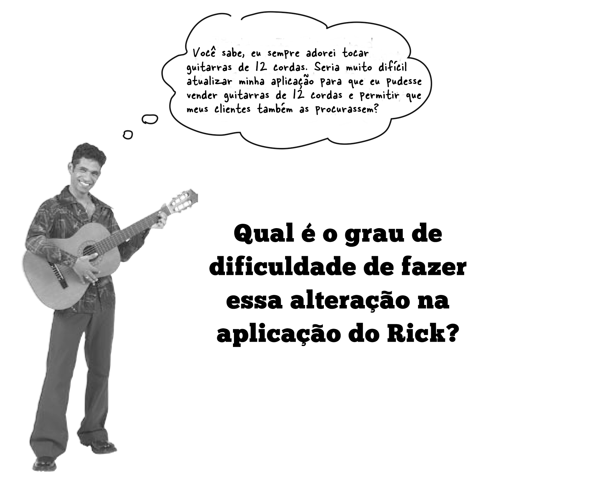
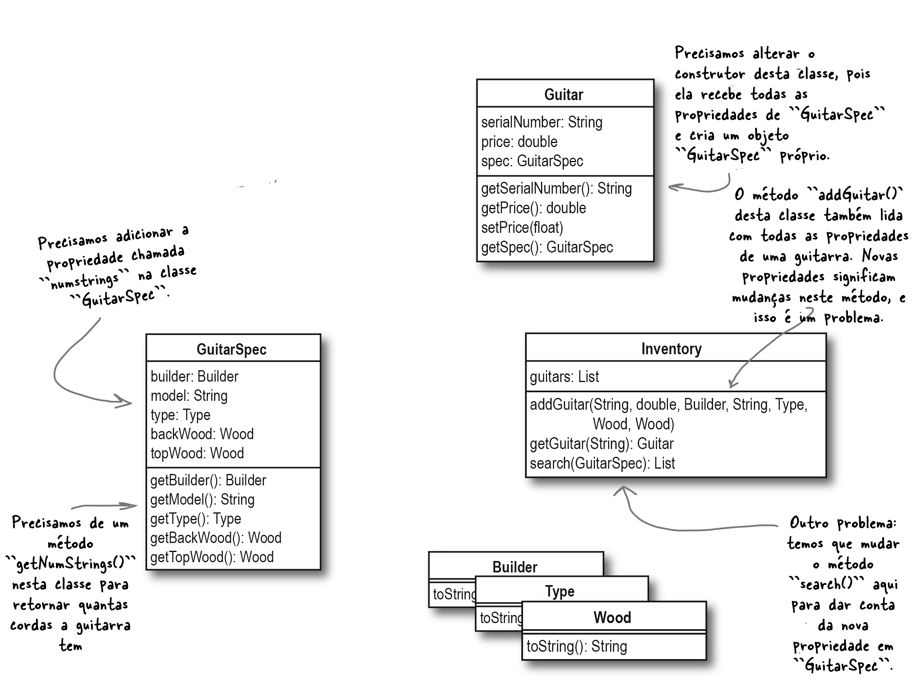
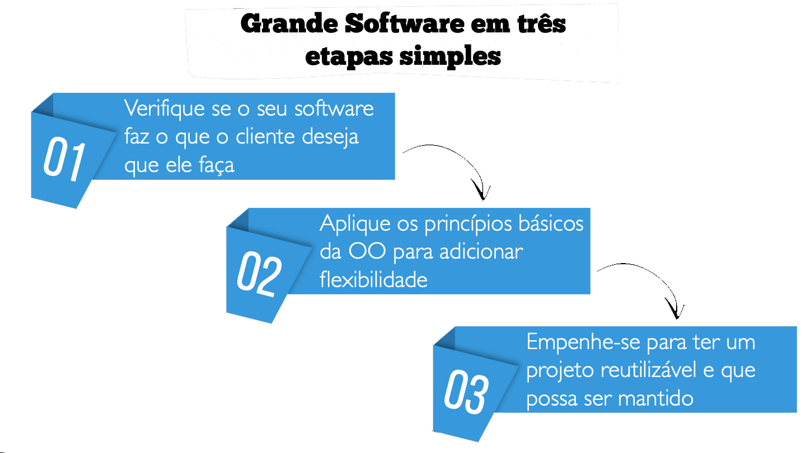

# **Grande Software Versão 3**

## **Etapa #3: Empenhe-se para ter um projeto reutilizável e que possa ser mantido**

Depois de dar uma primeira olhada em seu software e aplicar alguns princípios básicos de OO, você precisa certificar-se de que ele não seja apenas flexível, mas facilmente reutilizável e estendido. Ou seja, você agora está pronto para aplicar alguns padrões e realmente focar na reutilização.


## **Dúvida do Rick**




## **Fazendo a Alteração na Aplicação Atual - Parte I**


1. Precisamos adicionar uma nova propriedade na classe ``GuitarSpec``(Chame-a de ``numStrings``).

2. Precisamos de um método para retornar o número de cordas da guitarra (Chame-o de ``getNumStrings()``).

3. Precisamos alterar o construtor da Classe ``Guitar``

4. Precisamos alterar os métodos ``addGuitar()`` e ``search()`` da Classe ``Inventory``.

Observe o diagrama de classes com as alterações sugeridas.




## **Fazendo a Alteração na Aplicação Atual - Parte II**


### **Alterando a aplicação para que seja mais fácil reutilizar e estender**

**O Problema**

> Adicionar uma nova propriedade a ``GuitarSpec`` causará alterações no código das classes ``Guitar`` e ``Inventory``. A aplicação deve ser reestruturada de forma que a adição de propriedades a ``GuitarSpec`` não afete o código do resto da aplicação.
	
Porém, teremos alguns problemas. Vamos observar os códigos das classes.


**A Solução**

1. Adicione uma propriedade ``numStrings`` e um método ``getNumStrings()`` à classe ``GuitarSpec``

2. Modifique a classe ``Guitar`` para que as propriedades de ``GuitarSpec`` sejam encapsuladas fora do construtor da classe

3. Altere os métodos ``search()`` em ``Inventory`` para **delegar** a comparação dos dois objetos ``GuitarSpec`` à classe ``GuitarSpec``, em vez de lidar diretamente com ela

4. Efetue um teste para verificar se as alterações acima funcionam


**A Solução resolvida**

1. Adicione uma propriedade ``numStrings`` e um método ``getNumStrings()`` à classe ``GuitarSpec``

```python
class GuitarSpec:
    def __init__(self, builder, model, typeG, backWood, topWood, numStrings):
        self.builder = builder
        self.model = model
        self.typeG = typeG
        self.backWood = backWood
        self.topWood = topWood
        self.numStrings = numStrings

    def getBuilder(self):
        return self.builder

    def getTypeG(self):
        return self.typeG

    def getModel(self):
        return self.model

    def getBackWood(self):
        return self.backWood

    def getTopWood(self):
        return self.topWood

    def getNumStrings(self):
        return self.numStrings

...

```

2. Modifique a classe ``Guitar`` para que as propriedades de ``GuitarSpec`` sejam encapsuladas fora do construtor da classe

```python
class Guitar:
    def __init__(self, serialNumber, price, spec):
        self.serialNumber = serialNumber
        self.price = price
        self.spec = spec
        
...
```

3. Altere os métodos ``search()`` em ``Inventory`` para **delegar** a comparação dos dois objetos ``GuitarSpec`` à classe ``GuitarSpec``, em vez de lidar diretamente com ela.

```python
class Inventory:
    def __init__(self):
        self.guitars = []

    def addGuitar(self, serialNumber, price, spec):
        guitar = Guitar(serialNumber, price, spec)
        self.guitars.append(guitar)

    def getGuitar(self, serialNumber):
        for guitar in self.guitars:
            if guitar.getSerialNumber() == serialNumber:
                return guitar
        return None

    def search(self, searchGuitar):
        matchingGuitars = []
        for guitar in self.guitars:
            if guitar.getSpec().matches(searchGuitar):
                matchingGuitars.append(guitar)
        return matchingGuitars
```

> O método ``search()`` acima ficou muito mais simples.
> 
> A maior parte do código do método ``search()`` foi retirada da classe ``Inventory`` e colocada em um método chamado ``matches()`` na classe ``GuitarSpec``. Veja abaixo.

```python
class GuitarSpec:
    def __init__(self, builder, model, typeG, backWood, topWood, numStrings):
        self.builder = builder
        self.model = model
        self.typeG = typeG
        self.backWood = backWood
        self.topWood = topWood
        self.numStrings = numStrings

    def getBuilder(self):
        return self.builder

    def getTypeG(self):
        return self.typeG

    def getModel(self):
        return self.model

    def getBackWood(self):
        return self.backWood

    def getTopWood(self):
        return self.topWood

    def getNumStrings(self):
        return self.numStrings

    def matches(self, otherSpec):
        if self.builder != otherSpec.getBuilder():
            return False
        if self.model and self.model.lower() != otherSpec.getModel().lower():
            return False
        if self.typeG != otherSpec.getTypeG():
            return False
        if self.backWood != otherSpec.getBackWood():
            return False
        if self.topWood != otherSpec.getTopWood():
            return False
        if self.numStrings != otherSpec.getNumStrings():
            return False
        return True
```


4. Efetue um teste para verificar se as alterações acima funcionam

```python
def initializeInventory(inventory):
    spec1 = GuitarSpec(Builder.FENDER, "stratocastor", TypeG.ELECTRIC, Wood.ALDER, Wood.ALDER, 6)
    inventory.addGuitar("V95693", 1499.95, spec1)
    inventory.addGuitar("V99999", 1599.95, spec1)
    
    #spec2 = GuitarSpec(Builder.MARTIN, "D-18", TypeG.ACOUSTIC, Wood.MAHOGANY, Wood.ADIRONDACK, 6)
    #inventory.addGuitar("122784", 5495.95, spec2)
    #inventory.addGuitar("76531", 6295.95, Builder.MARTIN, "OM-28", TypeG.ACOUSTIC, Wood.BRAZILIAN_ROSEWOOD, Wood.ADIRONDACK, 6)
    #inventory.addGuitar("70108276", 2295.95, Builder.GIBSON, "Les Paul", TypeG.ELECTRIC, Wood.MAHOGANY, Wood.MAHOGANY, 6)
    #inventory.addGuitar("82765501", 1890.95, Builder.GIBSON, "SG '61 Reissue", TypeG.ELECTRIC, Wood.MAHOGANY, Wood.MAHOGANY, 6)
    #inventory.addGuitar("77023", 6275.95, Builder.MARTIN, "D-28", TypeG.ACOUSTIC, Wood.BRAZILIAN_ROSEWOOD, Wood.ADIRONDACK, 6)
 

def main():
    inventory = Inventory()
    initializeInventory(inventory)

    whatErinLikes = GuitarSpec(Builder.FENDER, "Stratocastor", TypeG.ELECTRIC, Wood.ALDER, Wood.ALDER, 6)
    matchingGuitars = inventory.search(whatErinLikes)

    if matchingGuitars:
        print("Erin, talvez você goste destas: ")
        for guitar in matchingGuitars:
            guitarSpec = guitar.getSpec()
            print(f"\nGuitarra: {guitar.getSerialNumber()} {guitarSpec.getBuilder().value} {guitarSpec.getModel()} {guitarSpec.getTypeG().value} guitar:\n{guitarSpec.getBackWood().value} na traseira e laterais,\n{guitarSpec.getTopWood().value} no tampo, com {guitarSpec.getNumStrings()} cordas\nEla pode ser sua por apenas US${guitar.getPrice():.2f}!")
    else:
        print("Desculpe Erin, não temos nada para você")

if __name__ == '__main__':
    main()
```

Você deverá ver um resultado como o abaixo.

```
Erin, talvez você goste destas: 

Guitarra: V95693 fender stratocastor electric guitar:
alder na traseira e laterais,
alder no tampo, com 6 cordas
Ela pode ser sua por apenas US$1499.95!

Guitarra: V99999 fender stratocastor electric guitar:
alder na traseira e laterais,
alder no tampo, com 6 cordas
Ela pode ser sua por apenas US$1599.95!
```

### Observações
> Para adicionar propriedades à classe ``GuitarSpec``, agora só é necessário fazer alterações nesta classe e não mais em ``Guitar`` ou ``Inventory``.


## Grande Software Versão 3 da aplicação

### Implemente as alterações necessárias para a Loja do Rick

1. Implemente as alterações descritas nos passos de 1 até 4.


## **O que fizemos**

Lembra-se das Três Etapas?  Nós as seguimos para transformar a ferramenta de pesquisa quebrada de Rick em um software funcional e bem projetado.




Vamos descrever nossas ações em cada etapa.

**Etapa 1: Verifique se o seu software faz o que o cliente deseja que ele faça**

> Começamos corrigindo alguns dos problemas de funcionalidade com a ferramenta de pesquisa do Rick.

> Passamos a adicionar mais algumas funcionalidades, para que a busca retornasse uma lista de guitarras.


**Etapa 2: Aplique os princípios básicos da OO para adicionar flexibilidade**

> Enquanto adicionamos recursos ou características, garantimos que nossas escolhas de design fossem realmente sólidas.

> Também encapsulamos as propriedades da guitarra e garantimos que poderíamos adicionar novas propriedades ao aplicativo facilmente.


**Etapa 3: Empenhe-se para ter um projeto reutilizável e que possa ser mantido**

> Nesta etapa também encapsulamos as propriedades da guitarra e garantimos que poderíamos adicionar novas propriedades ao aplicativo facilmente.

> Até adicionamos a característica de _delegação_ para que nossos objetos sejam menos dependentes uns dos outros e possam ser reutilizados facilmente.


## **Você se lembra deste probre homem?**


## **Ele só queria escrever um Grande Software**

* Você só precisa de um conjunto de etapas que deve ser seguido para garantir que o seu software funcione e que seja bem projetado;

* A Orientação a Objetos ajuda você a escrever um grande software sempre;

* A POO é somente uma abordagem para a escrita de software que se concentra em garantir que o seu código:

	* faça o que se espera que ele faça
	* seja flexível, fácil de alterar
	* possa ser facilmente mantido e reutilizado

## **E do Rick, você se lembra?**


