# **Grande Software Versão 5**

## De volta a ferramenta de pesquisa do Rick


> Agora que aprendemos alguns novos princípios de Orientação a Objeto, estamos prontos para tornar o aplicativo do Rick bem projetado e flexível. Aqui é onde paramos e alguns dos problemas que descobrimos:

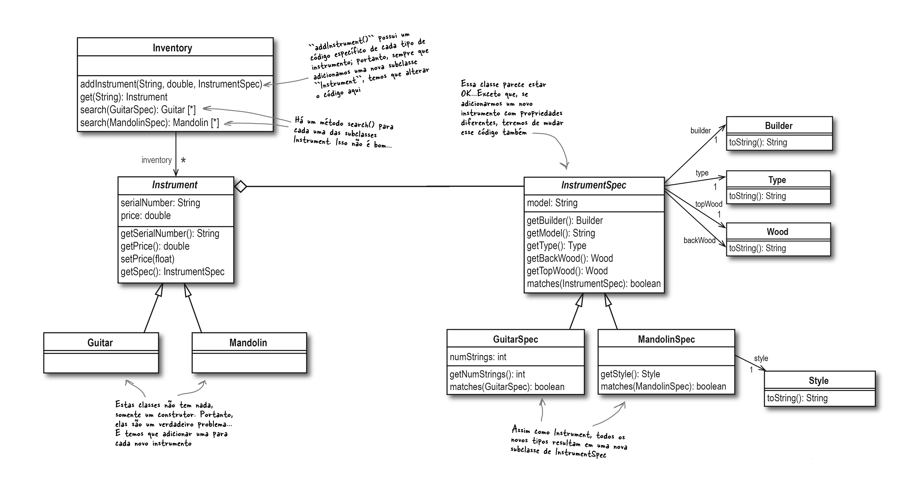


## **Analisando o diagrama**

Frank, Jill e Joe esquematizaram os próximos procedimentos. E também fizeram algumas anotações sobre o que discutiram. Veja a conversa deles abaixo.


* **Frank**: É, ele está estranho. Mas eu não vejo como podemos contorná-lo. Nós temos que permitir, de alguma forma, que os clientes do Rick procurem por cada tipo diferente do instrumento.

* **Jim**: Eu ainda não entendi porque não podemos simplesmente ter apenas um método ``search()`` que receba um ``IntrumentSpec``. Isso não eliminaria todas essas versões diferentes de ``search()``?

* **Joe**: Bem, eliminaria, mas ainda não teríamos qualquer forma de retornar vários tipos de instrumentos. Se o cliente fornece uma ``GuitarSpec``, nunca terá uma ocorrência de ``BanjoSpec`` ou de ``MandolinSpec``. Assim, a lista retornada de ``search()`` sempre terá somente o tipo de instrumento especificado pelo cliente.

* **Jim**: Isso acontece porque não podemos instanciar ``InstrumentSpec``, certo? É uma classe abstrata, portanto temos de criar um ``MandolinSpec``, ou um ``BanjoSpec``, ou seja lá o que for.

* **Frank**: Talvez seja esse o problema. Além disso, a gente não deveria estar codificando uma interface como ``InstrumentSpec``, ao invés de uma implementação, como ``GuitarSpec`` ou ``BanjoSpec``?

* **Joe**: Hum...Eu não tinha pensado nisso, mas você tem razão; nós realmente deveríamos nos concentrar na interface e não em todas aquelas classes de implementação.


### Uma olhada mais de perto no método ``search()``

Parece bastante claro que há um problema com a maneira como lidamos com as pesquisas dos clientes do Rick. Poderíamos fazer ``InstrumentSpec`` uma classe concreta, mas isso resolveria todos os nossos problemas? Vejamos a figura abaixo.

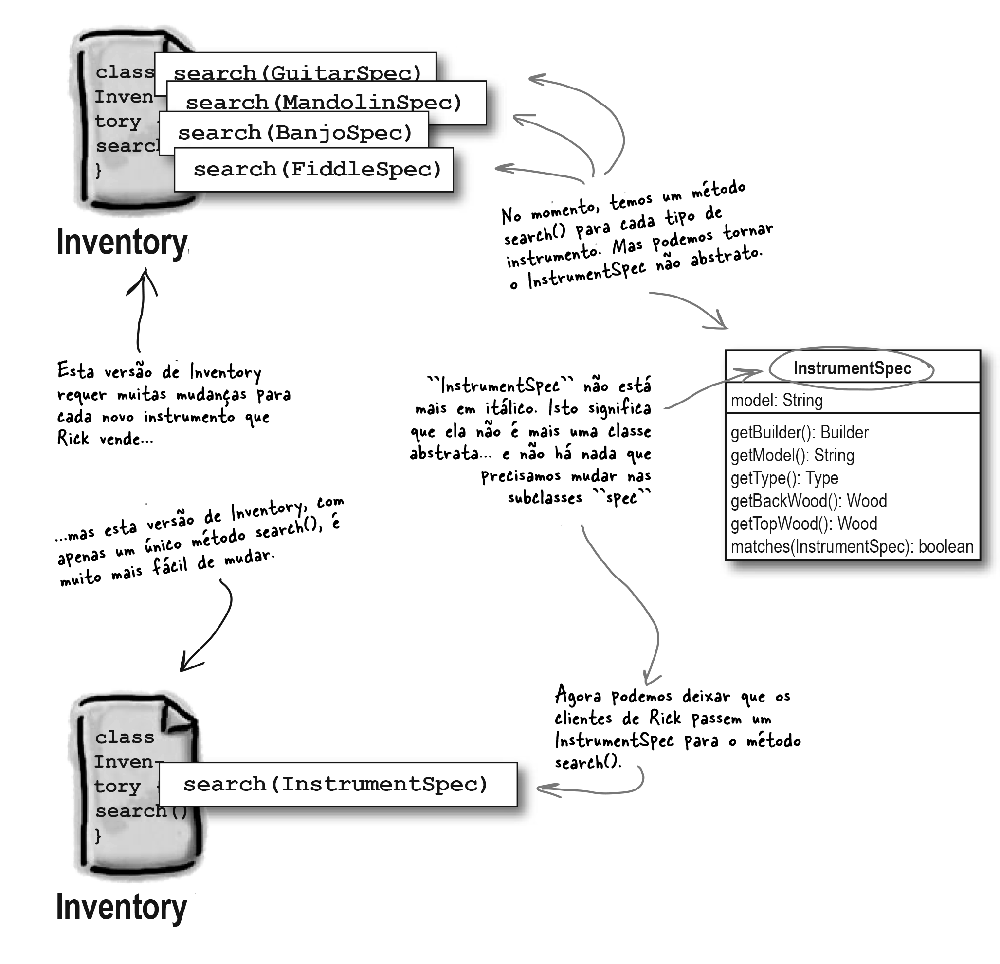


### Os benefícios da nossa análise

Vamos pegar o que descobrimos sobre transformar ``InstrumentSpec`` em uma classe concreta e ver se isso melhora o design de ``Inventory``.

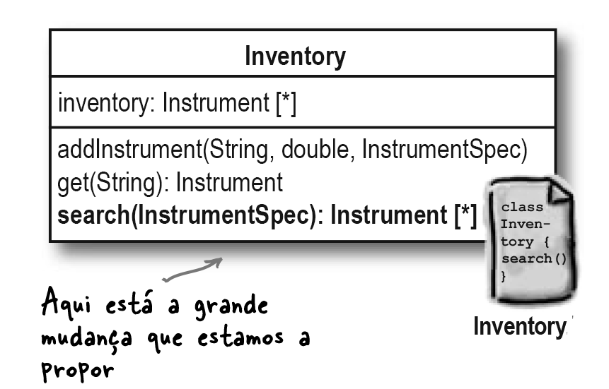


O código fica assim:

```python
class Inventory:
    def __init__(self):
        self.inventory = []

    def add_instrument(self, serial_number, price, spec):
        instrument = None
        if isinstance(spec, GuitarSpec):
            instrument = Guitar(serial_number, price, spec)
        elif isinstance(spec, MandolinSpec):
            instrument = Mandolin(serial_number, price, spec)
        self.inventory.append(instrument)

    def get(self, serial_number):
        for instrument in self.inventory:
            if instrument.get_serial_number() == serial_number:
                return instrument
        return None

    def search(self, search_spec):
        matching_instruments = []
        for instrument in self.inventory:
            if instrument.get_spec().matches(search_spec):
                matching_instruments.append(instrument)
        return matching_instruments
```

> **Observações quanto ao código:**
> 
> Ainda temos problema no método ``add_instrument``. Esse método fica maior e mais complicado cada vez que adicionamos um novo tipo de instrumento...
> 
> ... e observe que estamos codificando para uma implementação e não para a classe base.
> 
> O método ``search()`` está muito melhor. Somente uma versão que recebe uma ``InstrumentSpec``
> 
> Estamos codificando para uma classe base ``Instrument`` agora, não para as classes de implementação como ``Guitar`` e ``Mandolin``. Este é um design muito melhor.
> 
> O método ``search()`` pode retornar ocorrências de todos os instrumentos, mesmo com instrumentos diferentes na lista, como duas guitarras e um bandolim, por exemplo.

### Um exame mais detalhado da classe _Instrument_

O método ``search()`` não é a única coisa que dificulta a adição de novos instrumentos ao aplicativo do Rick. Você também precisa adicionar uma nova subclasse de ``Instrument`` para cada novo tipo de instrumento. Mas por que? Vamos fazer um pouco mais de análise. Vamos por examinar alguns pontos.

1. **O que todos os instrumentos têm em comum?**

	O número de série, o preço e algum conjunto de especificações (mesmo que os detalhes dessas especificações possam ser diferentes para diferentes tipos de instrumentos).


2. **Que coisas são diferentes entre os instrumentos?**

	As especificações: cada tipo de instrumento tem um conjunto diferente de propriedades que pode conter. E como cada instrumento tem um ``InstrumentSpec`` diferente, cada um tem um construtor diferente.

Se você tiver alguma ideia de como alterar o aplicativo do Rick para não precisar de todas as subclasses específicas do instrumento, marque essas alterações no diagrama de classe abaixo. Sinta-se à vontade para adicionar ou remover classes e propriedades. Cabe a você melhorar o design do Rick.

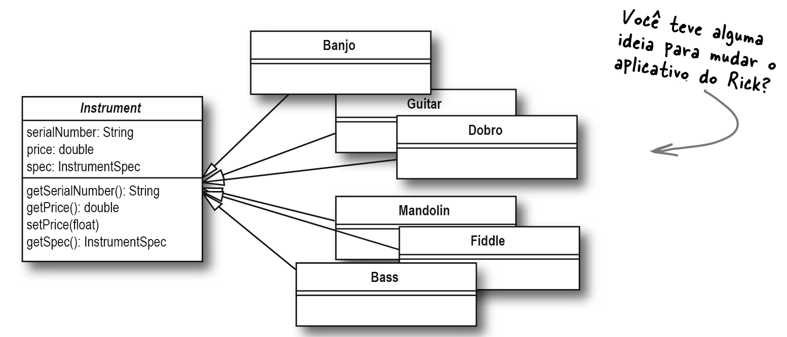


###  As classes estão relacionadas a comportamento!!

Normalmente, cria-se uma subclasse porque o comportamento é diferente da superclasse.

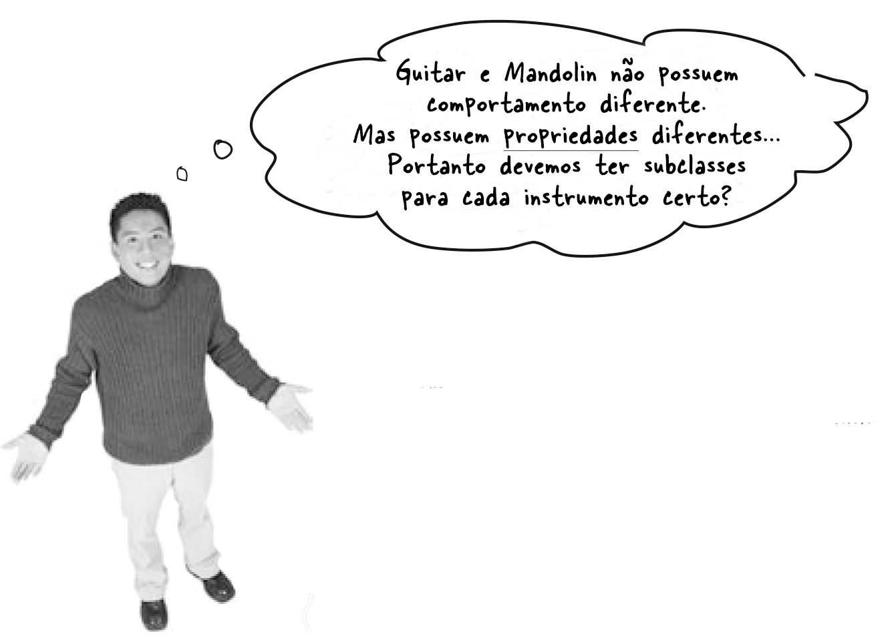

***

####Observação

Todos os instrumentos - pelo menos da perspectiva do Rick - se comportam da mesma forma. Isso deixa apenas dois motivos para ter subclasses para cada tipo de instrumento:

1. Como a classe ``Instrument`` representa um conceito, e não um objeto real, ela realmente deve ser abstrata. Portanto, temos que ter subclasses para cada tipo de instrumento.

> Este é um bom princípio de OO, mas com certeza está causando dores de cabeça com todas as subclasses. Voltaremos a ele futuramente.

2. Cada tipo diferente de instrumento tem propriedades diferentes e usa uma subclasse diferente de ``InstrumentSpec``, portanto, precisamos de um construtor específico do instrumento para cada tipo de instrumento.

> Isso parece outro caso em que estamos codificando para uma implementação em vez de uma interface. Portanto, este não é um bom motivo para manter a classe ``Instrument`` abstrata.

Os motivos parecem ser bem razoáveis mas isso gera um monte de classes extras que não fazem muita coisa... E isso torna o nosso software inflexível e difícil de mudar... 

Então, o que fazemos?

Você se lembra da segunda etapa para escrever um ótimo software? 

```
Aplique os princípios básicos da OO para adicionar flexibilidade!!!!
```

> Como o aplicativo do Rick já faz o que precisa (Etapa 1), estamos prontos para tentar tornar seu software mais flexível.


* **Joe**: Sim, você está falando sobre encapsular o que varia, certo? 

* **Frank**: Exatamente! E sabemos que as propriedades para cada
instrumento é o que varia na aplicação.

* **Jim**: Achei que já tínhamos superado isso; é por isso que temos todas essas subclasses de ``Instrument``, como ``Guitar`` e ``Mandolin``. Assim podemos representar as diferenças entre cada instrumento.

* **Frank**: Mas isso realmente não ajudou... e além disso, o comportamento de cada instrumento não varia, então precisamos mesmo de subclasses para cada um?

* **Joe**: Então você está dizendo que faríamos de ``Instrument`` uma classe concreta, em vez de abstrata, certo? E então podemos nos livrar de todas aquelas subclasses específicas de instrumentos.

* **Jim**: Mas... estou totalmente confuso. E as propriedades que variam em cada instrumento?

* **Frank**: E que têm eles? A classe ``Instrument`` tem uma referência a um ``InstrumentSpec` e todas as diferenças de propriedade podem ser tratadas por essas classes. Observe o diagrama de classes abaixo.

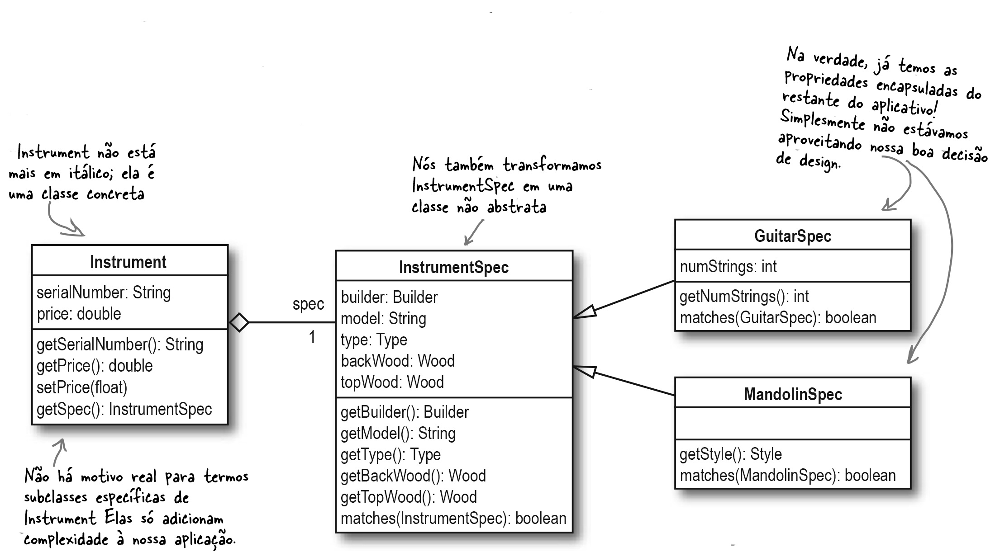


## **A morte de um projeto (decisão)**

Agora surge uma pergunta:

**Porque é tão difícil alterar um projeto depois de “pronto”?**

Na ferramenta de busca do Rick, não faz sentido ter subclasses de ``Instrument`` separadas para cada tipo de instrumento. Mas, porque levamos tanto tempo para descobrir isso?

```
Porque pareceu fazer sentido no momento e 
é DIFÍCIL mudar algo que você achou que 
já estava funcionando!!!
```

Lembre-se:

```
CODIFIQUE UMA VEZ, VERIFIQUE DUAS (OU MAIS!)
```
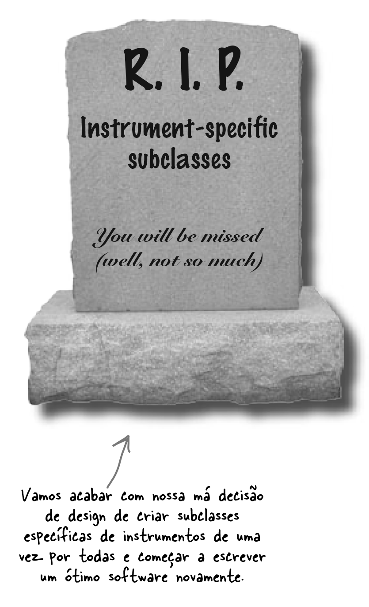


Mais duas coisas para lembrar sempre também:

```
O design é iterativo... e você deve estar disposto 
a mudar seus próprios designs, bem como aqueles 
que herdou de outros programadores.
```
***

```
O orgulho mata o bom design.
Nunca tenha medo de examinar suas próprias decisões de design 
e aprimorá-las, mesmo que isso signifique retroceder.
```

###Vamos transformar algumas decisões de design ruins  em boas

Vamos eliminar todas as subclasses específicas de instrumentos. Veja o diagrama abaixo.

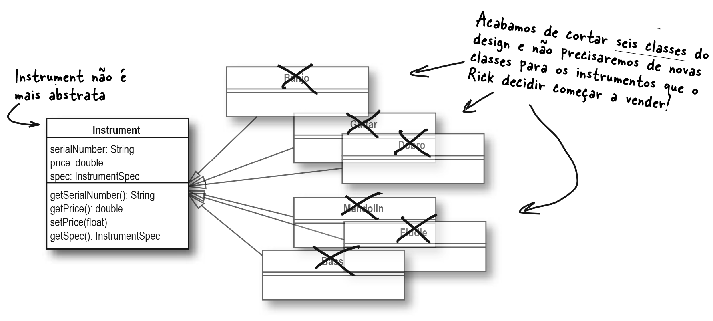

Provavelmente também precisamos de uma nova propriedade em cada instrumento para nos informar que tipo de instrumento é. Veja o diagrama abaixo.


### Continuando a verificação do projeto (mais um diálogo entre Frank, Joe e Jill (Parte I)


* **Joe**: Mas acabamos de fazer isso... tornamos a classe ``Instrument`` concreta e nos livramos de todas as subclasses específicas do instrumento.

* **Jill**: Na verdade, acho que esse é apenas o primeiro passo. O que realmente varia no software de Rick?

* **Frank**: Já passamos por isso: as propriedades de cada instrumento são as que variam.

* **Jill**: Então, podemos encapsulá-los de alguma forma?

* **Joe**: Já temos: usamos a classe ``InstrumentSpec`` para
que?

* **Frank**: Espere um segundo, Joe. Usamos ``InstrumentSpec`` porque essas propriedades foram usadas pelos clientes e instrumentos. Então, isso era mais sobre código duplicado ...

* **Jill**: Sim! Esse é o meu ponto... as propriedades dentro de ``InstrumentSpec`` também variam. Talvez precisemos adicionar outra camada de encapsulamento.

* **Joe**: Então, como as propriedades de cada instrumento variam, devemos retirá-las de ``InstrumentSpec``? É quase como encapsulamento duplo ou algo assim.

* **Jill**: Mais ou menos... encapsulamos as especificações comuns entre as solicitações do cliente e os instrumentos da classe ``Instrument`` e, em seguida, encapsulamos as propriedades que variam da classe ``InstrumentSpec``.

Veja o diagrama de classes que eles se referem.

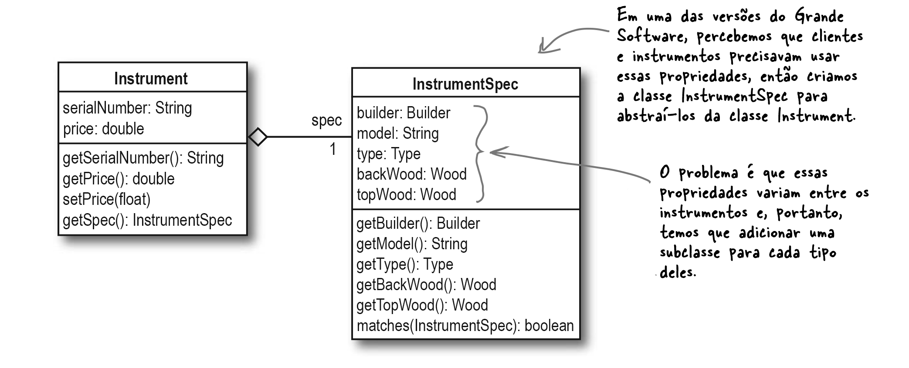

> Como algumas dessas propriedades variam, queremos movê-las para fora da classe ``InstrumentSpec``. Precisamos de uma maneira de nos referir às propriedades e seus valores, mas não ter essas propriedades codificadas dentro dela.
Alguma ideia de como poderíamos fazer isso?


***

**Nunca se esqueça: ao encapsular o que varia, você torna seu aplicativo mais flexível e mais fácil de alterar.**

***

### Continuando a verificação do projeto (mais um diálogo entre Frank, Joe e Jill (Parte II)

Decidimos que usar um dicionário (**Dict**) seria uma ótima maneira de lidar com vários tipos de propriedades e ainda poder adicioná-las facilmente a qualquer momento. Veja o diagrama de classes proposto abaixo.

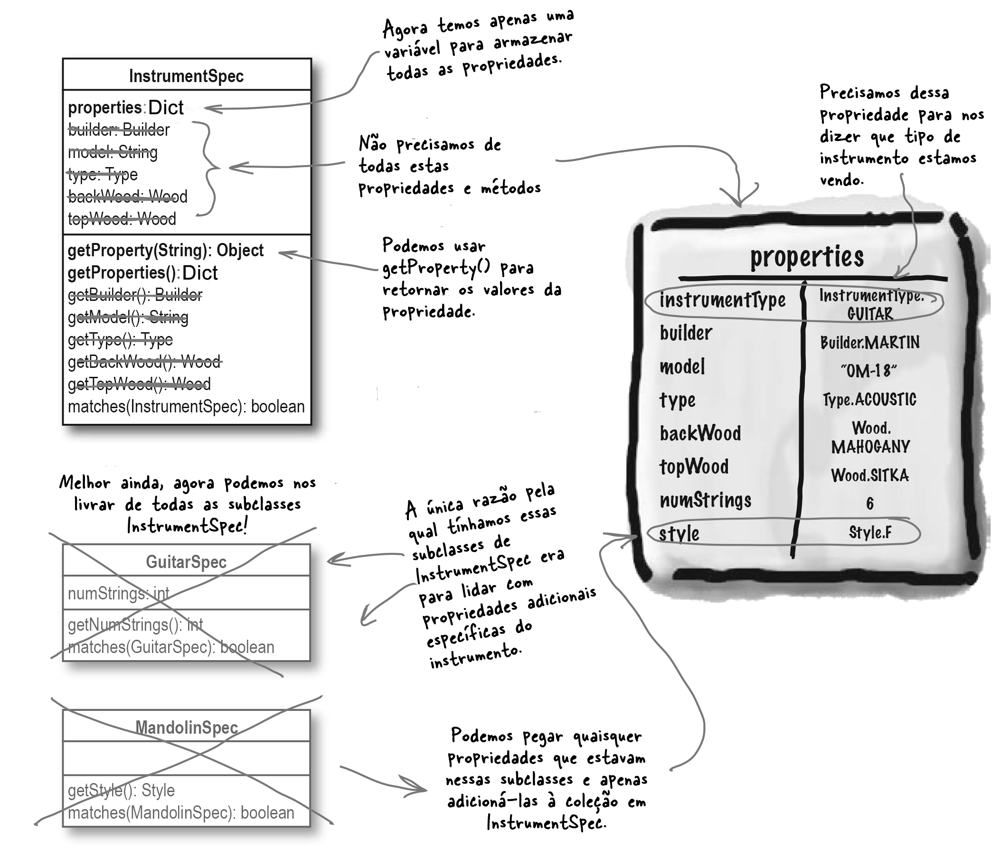

> Sempre que você visualizar algo que varia, você deve procurar uma maneira de encapsular. No caso de ``InstrumentSpec``, percebemos que as propriedades de um instrumento variam. Veja a figura abaixo.

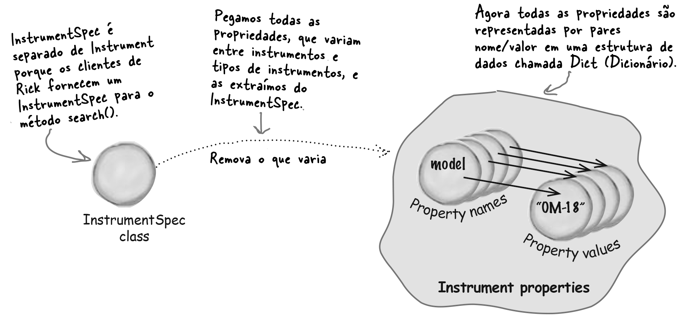

###Dicas Para Guardar

1. Quando você tiver um conjunto de propriedades que varia em seus objetos, use uma coleção, como um Dict (Dicionário), para
armazená-las dinamicamente!!!!

2. Você removerá vários métodos das suas classes e evitará alterações em seu código quando novas propriedades forem
adicionadas à sua aplicação!!!

Vamos, então, dar uma última olhada em como nossas novas classes ``Instrument`` e ``InstrumentSpec`` funcionam na prática. A figura baixo mostra onde estamos com o design agora.

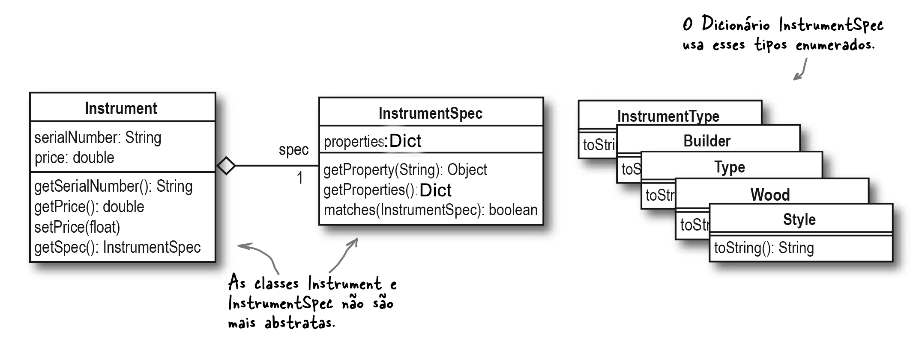

###A nova aplicação 'flexível' do Rick

Fizemos várias mudanças no aplicativo do Rick... e é fácil esquecer o objetivo do trabalho. Observe o diagrama de classe abaixo e veja como a aplicação dele está muito mais simples agora.

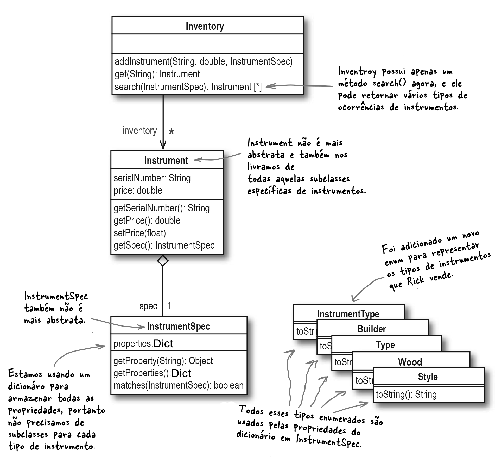

O código ficou assim:

```python
from enum import Enum

class Builder(Enum):
    FENDER = "fender"
    MARTIN = "martin"
    GIBSON = "gibson"
    COLLINGS = "collings"
    OLSON = "olson"
    RYAN = "ryan"
    PRS = "prs"
    ANY = "any"

class InstrumentType(Enum):
    GUITAR = "Guitar"
    BANJO = "Banjo"
    DOBRO = "Dobro"
    FIDDLE = "Fiddle"
    BASS = "Bass"
    MANDOLIN = "Mandolin"
    SAX = "Sax"
    UNSPECIFIED = "Unspecified"


class Style(Enum):
    A = "a"
    F = "f"


class Type(Enum):
    ACOUSTIC = "acoustic"
    ELECTRIC = "electric"


class Wood(Enum):
    INDIAN_ROSEWOOD = "indian_rosewood"
    BRAZILIAN_ROSEWOOD = "brazilian_rosewood"
    MAHOGANY = "mahogany"
    MAPLE = "maple"
    COCOBOLO = "cocobolo"
    CEDAR = "cedar"
    ADIRONDACK = "adirondack"
    ALDER = "alder"
    SITKA = "sitka"


class Instrument:
    def __init__(self, serial_number, price, spec):
        self.serial_number = serial_number
        self.price = price
        self.spec = spec

    def get_serial_number(self):
        return self.serial_number

    def get_price(self):
        return self.price

    def set_price(self, new_price):
        self.price = new_price

    def get_spec(self):
        return self.spec


class InstrumentSpec:
    def __init__(self, properties=None):
        if properties is None:
            self.properties = {}
        else:
            self.properties = properties.copy()

    def get_property(self, property_name):
        return self.properties.get(property_name)

    def get_properties(self):
        return self.properties

    def matches(self, other_spec):
        for property_name in other_spec.get_properties():
            if self.properties.get(property_name) != other_spec.get_property(property_name):
                return False
        return True


class Inventory:
    def __init__(self):
        self.inventory = []

    def add_instrument(self, serial_number, price, spec):
        instrument = Instrument(serial_number, price, spec)
        self.inventory.append(instrument)

    def get_instrument(self, serial_number):
        for instrument in self.inventory:
            if instrument.get_serial_number() == serial_number:
                return instrument
        return None

    def search(self, search_spec):
        matching_instruments = []
        for instrument in self.inventory:
            if instrument.get_spec().matches(search_spec):
                matching_instruments.append(instrument)
        return matching_instruments


def initialize_inventory(inventory):
    properties = {
        "instrumentType": InstrumentType.GUITAR.value,
        "builder": Builder.COLLINGS.value,
        "model": "CJ",
        "type": Type.ACOUSTIC.value,
        "numstrings": 6,
        "topwood": Wood.INDIAN_ROSEWOOD.value,
        "backwood": Wood.SITKA.value
    }
    inventory.add_instrument("11277", 3999.95, InstrumentSpec(properties))

    properties = {
        "instrumentType": InstrumentType.GUITAR.value,
        "builder": Builder.GIBSON.value,
        "model": "Les Paul",
        "type": Type.ELECTRIC.value,
        "numstrings": 6,
        "topwood": Wood.MAPLE.value,
        "backwood": Wood.MAPLE.value
    }
    inventory.add_instrument("70108276", 2295.95, InstrumentSpec(properties))

    properties = {
        "instrumentType": InstrumentType.MANDOLIN.value,
        "builder": Builder.GIBSON.value,
        "model": "F5-G",
        "type": Type.ACOUSTIC.value,
        "topwood": Wood.MAPLE.value,
        "backwood": Wood.MAPLE.value,
        "style": Style.A.value
    }
    inventory.add_instrument("9019920", 5495.99, InstrumentSpec(properties))

    properties = {
        "instrumentType": InstrumentType.BANJO.value,
        "builder": Builder.GIBSON.value,
        "model": "RB-3",
        "type": Type.ACOUSTIC.value,
        "numstrings": 5,
        "backwood": Wood.MAPLE.value
    }
    inventory.add_instrument("8900231", 2945.95, InstrumentSpec(properties))


def main():
    inventory = Inventory()
    initialize_inventory(inventory)

    properties = {
        "builder": Builder.GIBSON.value,
        "backwood": Wood.MAPLE.value
    }
    client_spec = InstrumentSpec(properties)
    matching_instruments = inventory.search(client_spec)
    if matching_instruments:
        print("Talvez você goste desses instrumentos:")
        for instrument in matching_instruments:
            spec = instrument.get_spec()
            print(spec.get_property("instrumentType"), "com as seguintes propriedades:")
            for property_name, property_value in spec.get_properties().items():
                if property_name == "instrumentType":
                    continue
                print(property_name + ":", property_value)
            print("Ele pode ser seu por apenas $", instrument.get_price())
            print()
    else:
        print("Desculpe, não temos nada para você")

if __name__ == "__main__":
    main()
```


## Grande Software Versão 5 da aplicação

### Implemente as alterações necessárias para a Loja do Rick

1. Estude a estrutura ``Dict`` e o código fornecido

2. Implemente a nova aplicação do Rick

3. Acrescente o estoque que está na figura abaixo como exemplo

4. Expanda a aplicação para que seja possível vender saxofones

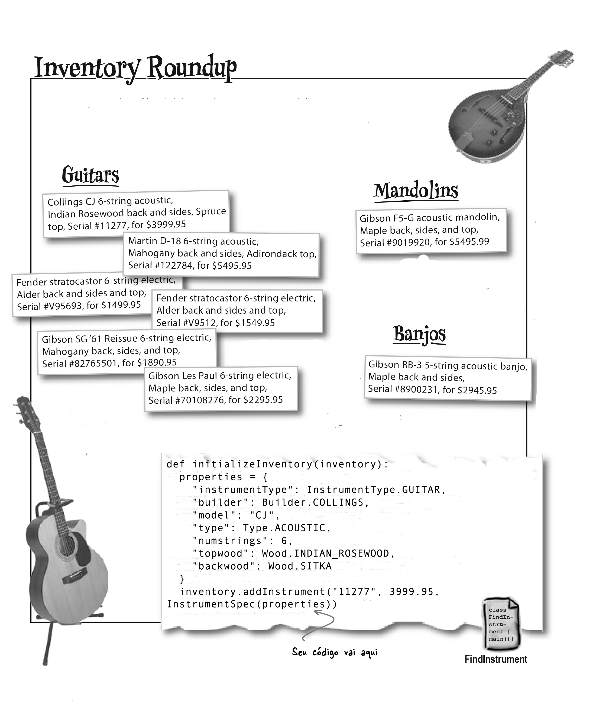

